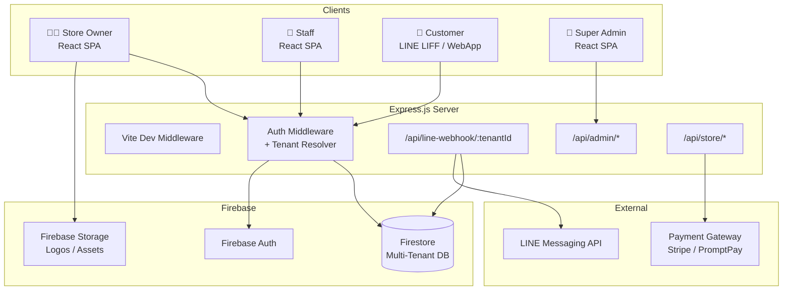
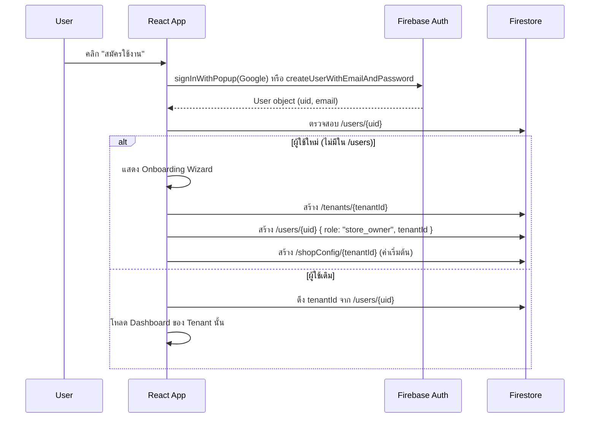
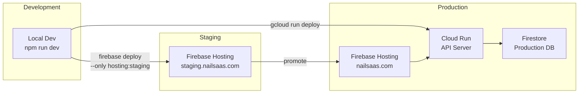

# 🏗️ Architecture — NailSaaS Multi-Tenant Platform

> **Version:** 1.0  
> **Date:** 2026-04-19

---

## 1. System Architecture Overview



---

## 2. Multi-Tenant Data Architecture

### 2.1 Strategy: Shared Database + Tenant ID

เลือกใช้แนวทาง **Shared Database with Tenant Discriminator** เพราะ:
- Firestore ไม่เหมาะกับการสร้าง Database แยกต่อร้าน (cost/complexity สูง)
- เหมาะกับ SaaS ขนาดเล็ก-กลาง (≤1,000 tenants)
- ลดค่าใช้จ่าย Firebase ได้มากที่สุด

### 2.2 Firestore Collection Structure (Before → After)

```
❌ BEFORE (Single-Tenant)
├── /members/{memberId}
├── /packages/{packageId}
├── /transactions/{transactionId}
├── /bookings/{bookingId}
├── /packageTemplates/{templateId}
├── /serviceTemplates/{templateId}
├── /branches/{branchId}
└── /shopConfig/main

✅ AFTER (Multi-Tenant)
├── /tenants/{tenantId}                    ← NEW: ข้อมูลร้านค้า
│   ├── shopName, shopPhone, logo, theme
│   ├── subscription: { plan, status, expiresAt }
│   ├── lineConfig: { channelAccessToken, channelSecret }
│   └── createdAt, isActive
│
├── /users/{userId}                        ← NEW: ข้อมูลผู้ใช้งาน
│   ├── email, displayName
│   ├── role: "super_admin" | "store_owner" | "staff"
│   ├── tenantId (ผูกกับร้านค้า)
│   └── createdAt
│
├── /members/{memberId}                    ← MODIFIED: เพิ่ม tenantId
│   ├── tenantId ★
│   ├── name, phone, points, tier, totalSpent
│   ├── lineUserId, lineDisplayName
│   └── createdAt, lastVisit
│
├── /packages/{packageId}                  ← MODIFIED: เพิ่ม tenantId
│   ├── tenantId ★
│   ├── memberId, title, totalSessions, remainingSessions
│   └── status, expiryDate
│
├── /transactions/{transactionId}          ← MODIFIED: เพิ่ม tenantId
│   ├── tenantId ★
│   ├── memberId, type, amount, pointsChange
│   └── serviceName, timestamp
│
├── /bookings/{bookingId}                  ← MODIFIED: เพิ่ม tenantId
│   ├── tenantId ★
│   ├── memberId, memberName, memberPhone
│   ├── serviceName, date, timeSlot
│   └── branchId, branchName, status
│
├── /packageTemplates/{templateId}         ← MODIFIED: เพิ่ม tenantId
│   ├── tenantId ★
│   └── title, price, sessions
│
├── /serviceTemplates/{templateId}         ← MODIFIED: เพิ่ม tenantId
│   ├── tenantId ★
│   └── name, price
│
├── /branches/{branchId}                   ← MODIFIED: เพิ่ม tenantId
│   ├── tenantId ★
│   └── name, phone, lat, lng, address
│
├── /shopConfig/{tenantId}                 ← MODIFIED: key = tenantId
│   ├── shopName, shopPhone
│   ├── businessHours[]
│   └── theme: { primaryColor, logo }
│
└── /invitations/{inviteId}                ← NEW: ระบบเชิญพนักงาน
    ├── tenantId, email, role
    ├── invitedBy, status
    └── createdAt, expiresAt
```

### 2.3 Firestore Composite Indexes (Required)

```
Collection         | Fields                              | Order
--------------------|--------------------------------------|-------
members            | tenantId ASC, createdAt DESC         | —
packages           | tenantId ASC, memberId ASC           | —
transactions       | tenantId ASC, memberId ASC, timestamp DESC | —
bookings           | tenantId ASC, createdAt DESC         | —
packageTemplates   | tenantId ASC, title ASC              | —
serviceTemplates   | tenantId ASC, name ASC               | —
branches           | tenantId ASC, createdAt DESC         | —
```

---

## 3. Authentication & Authorization Architecture

### 3.1 Auth Flow



### 3.2 Role Permissions Matrix

| Permission | Super Admin | Store Owner | Staff |
|-----------|:-----------:|:-----------:|:-----:|
| ดูร้านค้าทั้งหมด | ✅ | ❌ | ❌ |
| สร้างร้านค้าใหม่ | ✅ | ✅ (ของตัวเอง) | ❌ |
| ระงับ/เปิดร้านค้า | ✅ | ❌ | ❌ |
| จัดการ Subscription | ✅ | ✅ (ของตัวเอง) | ❌ |
| ดูข้อมูลลูกค้า | ✅ | ✅ | ✅ (อ่านเท่านั้น) |
| เพิ่ม/แก้ไขลูกค้า | ❌ | ✅ | ✅ |
| ลบลูกค้า | ❌ | ✅ | ❌ |
| จัดการบริการ/แพ็กเกจ | ❌ | ✅ | ❌ |
| สะสมแต้ม/ตัดรอบ | ❌ | ✅ | ✅ |
| ตั้งค่าร้าน | ❌ | ✅ | ❌ |
| เชิญพนักงาน | ❌ | ✅ | ❌ |
| ตั้งค่า LINE | ❌ | ✅ | ❌ |

---

## 4. Application Architecture

### 4.1 Frontend Component Tree (React)

```
App.tsx
├── AuthGuard                              ← NEW: ดักจับ Auth state
│   ├── TenantProvider                     ← NEW: Context ให้ทุก Component
│   │   │
│   │   ├── [role === super_admin]
│   │   │   └── SuperAdminLayout
│   │   │       ├── SuperAdminDashboard    ← NEW
│   │   │       ├── TenantList             ← NEW
│   │   │       └── TenantDetail           ← NEW
│   │   │
│   │   ├── [role === store_owner | staff]
│   │   │   └── StoreLayout (เดิม = App shell)
│   │   │       ├── Dashboard              (เดิม — เพิ่ม tenantId filter)
│   │   │       ├── MemberList             (เดิม — เพิ่ม tenantId filter)
│   │   │       ├── MemberDetails          (เดิม)
│   │   │       ├── BookingManager         (เดิม — เพิ่ม tenantId filter)
│   │   │       ├── PackageTemplatesManager(เดิม — เพิ่ม tenantId filter)
│   │   │       ├── ServiceTemplatesManager(เดิม — เพิ่ม tenantId filter)
│   │   │       ├── Settings               (เดิม — เพิ่ม tenantId filter)
│   │   │       └── StaffManager           ← NEW
│   │   │
│   │   └── [ยังไม่เคยสมัครร้าน]
│   │       └── OnboardingWizard           ← NEW
│   │
│   └── LoginPage                          (ปรับปรุงจากเดิม)
│
└── CustomerApp                            ← NEW (สำหรับ LINE LIFF)
    ├── CustomerCard                       (เดิม — standalone)
    └── BookingForm                        (เดิม — standalone)
```

### 4.2 State Management: TenantContext

```typescript
// src/contexts/TenantContext.tsx — NEW
interface TenantContextValue {
  tenantId: string;
  tenantData: Tenant;
  userRole: 'super_admin' | 'store_owner' | 'staff';
  shopConfig: ShopConfig;
}

// ใช้งาน:
const { tenantId } = useTenant();
const q = query(
  collection(db, 'members'),
  where('tenantId', '==', tenantId),        // ← ทุก query ต้องมี
  orderBy('createdAt', 'desc')
);
```

---

## 5. Backend Architecture (server.ts)

### 5.1 Route Structure

```
Express Server (port 3000)
│
├── Middleware
│   ├── express.json()
│   ├── cors()
│   └── authMiddleware()                   ← NEW: ตรวจสอบ Firebase ID Token
│
├── Public Routes
│   ├── POST /api/line-webhook/:tenantId   ← MODIFIED: Dynamic per tenant
│   └── GET  /api/health
│
├── Store Routes (ต้อง Auth + tenantId)
│   ├── POST /api/store/simulate-line-follow
│   └── GET  /api/store/diag
│
├── Admin Routes (ต้อง Auth + super_admin)
│   ├── GET    /api/admin/tenants
│   ├── PATCH  /api/admin/tenants/:tenantId
│   └── GET    /api/admin/stats
│
└── Vite Dev Middleware (Development)
```

### 5.2 LINE Webhook — Dynamic Tenant Resolution

```typescript
// BEFORE (Single-tenant)
app.post('/api/line-webhook', lineMiddleware, (req, res) => { ... });

// AFTER (Multi-tenant)
app.post('/api/line-webhook/:tenantId', async (req, res) => {
  const { tenantId } = req.params;
  
  // 1. ดึง LINE config จาก /tenants/{tenantId}
  const tenantDoc = await db.collection('tenants').doc(tenantId).get();
  const { lineConfig } = tenantDoc.data();
  
  // 2. Validate signature ด้วย channelSecret ของ tenant นั้น
  // 3. Process events — สมัครลูกค้าลงใน tenant ที่ถูกต้อง
});
```

---

## 6. Security Architecture

### 6.1 Firestore Security Rules (Multi-Tenant)

```javascript
rules_version = '2';
service cloud.firestore {
  match /databases/{database}/documents {
    
    // Helper: ดึง tenantId ของ user ปัจจุบัน
    function getUserTenantId() {
      return get(/databases/$(database)/documents/users/$(request.auth.uid)).data.tenantId;
    }
    
    // Helper: ตรวจสอบ role
    function getUserRole() {
      return get(/databases/$(database)/documents/users/$(request.auth.uid)).data.role;
    }
    
    function isSuperAdmin() {
      return getUserRole() == 'super_admin';
    }
    
    function isStoreOwner() {
      return getUserRole() == 'store_owner';
    }
    
    function belongsToTenant(tenantId) {
      return getUserTenantId() == tenantId;
    }
    
    // Tenant documents
    match /tenants/{tenantId} {
      allow read: if request.auth != null && (isSuperAdmin() || belongsToTenant(tenantId));
      allow write: if isSuperAdmin() || (isStoreOwner() && belongsToTenant(tenantId));
    }
    
    // Members — ต้องอยู่ใน tenant เดียวกัน
    match /members/{memberId} {
      allow read, write: if request.auth != null && 
        (isSuperAdmin() || belongsToTenant(resource.data.tenantId));
      allow create: if request.auth != null && 
        (isSuperAdmin() || belongsToTenant(request.resource.data.tenantId));
    }
    
    // ... (Pattern เดียวกันสำหรับ collections อื่น ๆ)
  }
}
```

### 6.2 Defense-in-Depth Layers

```
Layer 1: Firestore Security Rules     → ป้องกันที่ database level
Layer 2: Frontend TenantContext        → ทุก query มี tenantId filter
Layer 3: Server-side validation        → API routes ตรวจสอบ tenantId ก่อน write
Layer 4: UI Role-based rendering       → ซ่อน UI ตาม role
```

---

## 7. Deployment Architecture



### 7.1 Environment Configuration

```
.env.development          → Local dev, Firestore emulator
.env.staging               → Staging Firebase project
.env.production            → Production Firebase project
```

---

## 8. Technology Decisions

| Decision | Choice | Rationale |
|----------|--------|-----------|
| Multi-tenant strategy | Shared DB + tenantId | ลดค่าใช้จ่าย, เหมาะกับ Firestore |
| State management | React Context + Firestore onSnapshot | ไม่ต้องเพิ่ม library (Redux/Zustand) เพราะ Firestore เป็น real-time อยู่แล้ว |
| Routing | React Router v7 | รองรับ nested routes สำหรับ Super Admin / Store layouts |
| Auth | Firebase Auth + Custom Claims (Phase 2) | ง่าย, ไม่ต้องจัดการ JWT เอง |
| Payment | Stripe (Phase 2) | รองรับ recurring payments, webhook |
| LINE LIFF | LIFF SDK v2 (Phase 3) | เปิด WebApp ใน LINE ได้เลย |
